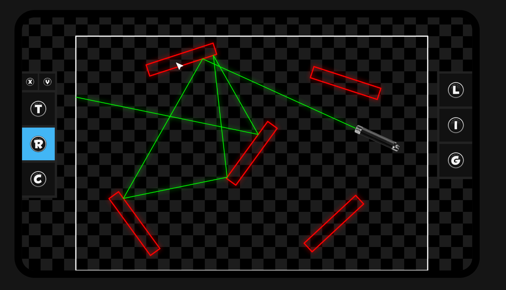

# optics 🔍

Lightweight real-time **ray optics** simulation that implements the physics phenomena of reflection and refraction.

Designed mostly for **education** and not professional use. 📚


## User Interface 👌



### Input

There are three different mouse tools to interact with the lasers and mirrors. The bar on the left shows which tool is currently activated.

* **Translation tool** indicated by the move symbol, is used to translate the objects in the scene.
This option has two additional subtools to limit the movement in a certain axis.

* **Rotation tool** indicated by the spinning arrow symbol, is used to set the rotation of the objects in the scene.

* **Change tool** indicated by the list symbol, is used to interact with the properties specific to the object you are selecting.
For lasers, this is used to toggle the emission ON and OFF. 
For interferers, this is used to cycle the type from refractive, reflective, and absorptive.
If the interferer is in refractive mode, the index of refraction can be dialed up and down an extended amount with the mouse.
For guide tools, this is used to toggle between a ruler and a protractor.

* **Laser tool** indicated by the laser symbol, is used to create a laser at the current mouse position.
Once laser is created, rotation tool is automatically selected to specify the angle of the laser.

* **Interferer tool** indicated by the polygon symbol, is used to create an interferer at the current mouse position.
Once interferer is created, change tool is automatically selected to specify the type of object.

* **Guide tool** indicated by the ruler or protractor symbol, is used to create a ruler or protractor at the current mouse location based on the context of the scene.
Once guide is created, rotational tool is automatically selected to specify the angle of the guide.
The guide has no influence on the scene and if it is a protractor and translation tool is selected, the position will snap to the scene laser collisions.

### Output

Three types of interferer objects are displayed differently.

* **Absorbing** objects have white contour.

* **Reflecting** mirrors have red contour and zero fill.

* **Refracting** lenses have red contour and red fill *(the higher the refractive index of the lens, the more visible the filled color)*.

## Keybindings 🔑

### Tools

```T``` - Switch to translation tool.

```X``` - Switch to horizontal translation subtool *(only works when translation tool or subtool is selected)*.

```Y``` - Switch to vertical translation subtool *(only works when translation tool or subtool is selected)*.

```R``` - Switch to rotation tool.

```C``` - Switch to change tool.

### Creation

```L``` - Instantiate a laser device from where the mouse is located.

```I``` - Instantiate a random polygonal interferer from where the mouse is located.

```G``` - Instantiate a ruler guide tool from where the mouse is located.

### Camera

```(ARROW)``` or ```(WASD)``` - Pan the camera horizontally and vertically.

### Scene

```(DELETE)``` or ```(BACKSPACE)``` or ```0``` - Remove all the objects from the scene.

```(NUMBER)``` - Load a predefined scene in the program.

### Extra

```F``` - Toggle browser fullscreen mode (shows canvas).

```H``` - Toggle in-canvas hints for user actions.

```Z``` - Toggle between quality and performance (toggles shadow blur effect off or on).

## Limitations 🔒

To avoid performance losses, the maximum collisions per each laser path is set to 50 in the code.
