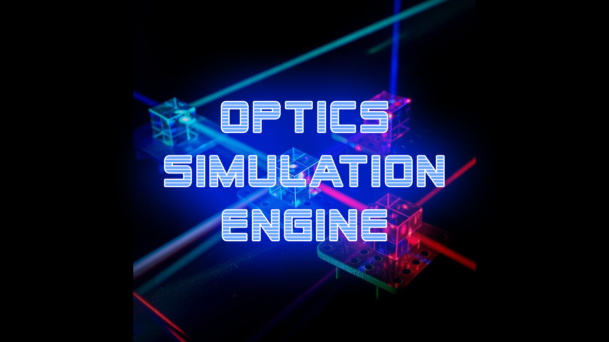

# opticsJS 🔍
Lightweight real-time **ray optics simulation** that implements the physics phenomena of reflection and refraction.

📚 Designed mostly for **education** and not professional use.



## 👌 User Interface

### Input
There are three different mouse tools to interact with the lasers and mirrors. The bar on the left shows which tool is currently activated.

1) **Translation tool** indicated by the move symbol to translate the objects in the scene.
This option has two additional submodes to limit the movement in a certain axis.

2) **Rotation tool** indicated by the spinning arrow symbol to set the rotation of the objects in the scene.

3) **Object tool** indicated by the cube symbol to interact with the properties specific to the object you are selecting.
For lasers, this is used to toggle the emission ON and OFF. 
For mirrors, this is used to cycle the type of interference from refractive, reflective, absorbtive.
If the mirror is in refractive mode, the index of refraction can be dialed up and down an extended amount with the mouse.
For guide tools, this is used to toggle between a ruler and a protractor.

### Output
Three types of mirror are displayed differently.
* **Absorbing** mirrors have a gray contour.
* **Reflecting** mirrors have a red contour and no color filled in.
* **Refracting** mirrors have a red contour and color filled in.  
The higher the refractive index of the object is, the more visible the inside color.

## 🔑 Keybindings

### Tools
```T``` - Translation mode

```X``` - Horizontal translation submode (only works once in translation mode)

```Y``` - Vertical translation submode (only works when in translation mode)

```R``` - Rotation mode

```C``` - Change mode 

### Creation
```L``` Instantiate a laser from where the mouse is located.

```I``` instantiate a random polygonal mirror from where the mouse is located.

```G``` instantiate a ruler guide tool from where the mouse is located.

### Camera
```(Arrow Keys)``` - Move the camera.

### Extra
```(Delete)``` - Remove all the lasers and mirrors from the scene.

```(Number Keys)``` - Load a predefined scene in the program.

```Z``` - Toggle quality/performance.

## 🔒 Limitations
To avoid crashes, the maximum collisions per each laser is set to 50.

In rare cases, when a laser hits a corner there is a chance that the laser incorrectly passes through instead of the right behavior of reflecting.
